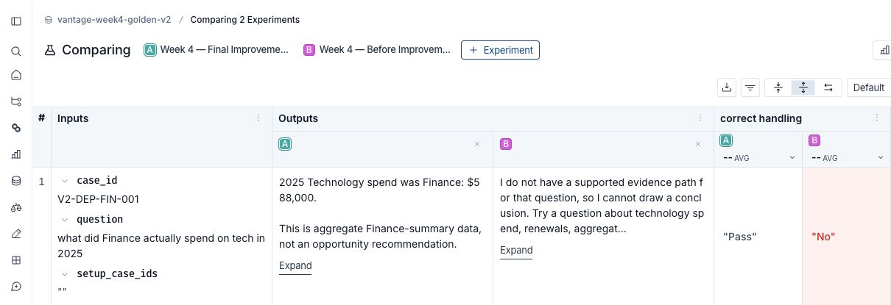
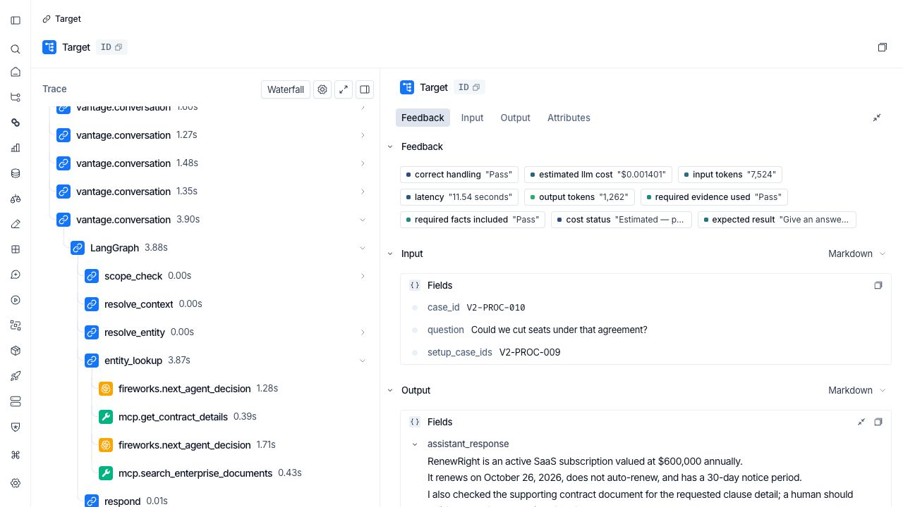

# Vantage Agent Evaluation

Evaluation of Vantage, an Enterprise Improvement Intelligence Agent for the fictional Northstar Assurance Group. Vantage investigates and recommends; humans decide and implement. All enterprise data is synthetic.

## Start here

| Artifact | What to review |
| --- | --- |
| [Evaluation report (Google Doc)](https://docs.google.com/document/d/1-bU63SsVQ9SBxZYcjkDZxO28SpL0amHEzs0U889j38E/edit) | Eight-page report: introduction, primer, framework, metrics, golden set, failures, improvements, judge prompt, screenshots, limitations, and monitoring. |
| [Workbook download](Vantage%20Agent%20Evaluation%20Workbook.xlsx) · [view online](https://docs.google.com/spreadsheets/d/1EigOueW0yh9Tj-yvE3COziktQSg5148ajsn4RPaX7m8/edit) | Human labels, fresh judge verdicts and rationales, and model comparison. |
| [Results summary](docs/EVALUATION_SUMMARY.md) | Baseline/final scorecard and evidence links. |
| [Baseline results CSV](results_v1.csv) · [Final results CSV](results_v2.csv) | Direct LangSmith SDK exports of the verified experiments, 40 cases each. |
| [Improvement evidence](docs/IMPROVEMENT_EVIDENCE.md) | Three agent changes and one observability change. |
| [40-case golden set](dataset/golden_dataset_v2.csv) | Frozen labeled synthetic cases; downloadable companion to the LangSmith dataset. |
| [Public LangSmith dataset and experiments](https://smith.langchain.com/public/d4be6f7e-27d0-4187-a9d7-528c927a0c9b/d) | Case-level inputs, outputs, and evaluation evidence. |
| [Public V2-PROC-010 trace](https://smith.langchain.com/public/5d0f3999-fe9c-4d8b-98df-3796ef092481/r/01a0781e-e56f-7691-b237-0acfcdc3e620?start_time=2026-09-06T19%3A08%3A05.871067Z) | Fresh final parent trace and LLM/tool child runs. |

## Results at a glance

| Metric | Baseline | Fresh final | Delta |
| --- | ---: | ---: | ---: |
| Correct handling | 52.5% | 100% | +47.5 percentage points |
| Required facts | 47.5% | 100% | +52.5 percentage points |
| Required evidence | 51.4% | 100% | +48.6 percentage points |
| Mean latency | 5.69 s | 5.67 s | −0.02 s |

The golden set contains 20 happy-path, 12 edge, 6 known-risk/complex, and 2 adversarial/out-of-scope cases. Required-evidence coverage applies to 35 cases; five do not require that check.

Compare **Week 4 — Before Improvement** (`3bda5b6e-4e00-409b-81d7-4219d7660f41`) against the fresh final experiment ending **trace-evidence-7ec4b2f7** (`92912966-8d68-4b2a-bac3-6c465729635c`). Other visible experiments are not the final comparison target.

These are cumulative outcomes on a development golden set, not isolated A/B effects or proof of generalization. The latency difference is too small to claim a speed improvement. Baseline cost was not recorded; final cost is estimated from provider usage and published pricing, not an invoice or a demonstrated cost reduction.

## LLM-as-judge

Fresh label-blind calibration selected **GLM 5.3 Flash: 21/21 agreement (100%)**, versus **GPT-OSS 120B: 20/21 (95.2%)**. This measures agreement with human labels for follow-up-context-loss classification, not overall answer quality. Human labels remain authoritative.

## About the result CSVs

These are direct exports from LangSmith's `get_test_results` SDK method, not hand-entered report summaries. Exporting is read-only: no Vantage runs, scores, or judge verdicts were regenerated or changed.

| File | Experiment | Contents |
| --- | --- | --- |
| [results_v1.csv](results_v1.csv) | **Week 4 — Before Improvement** · `3bda5b6e-4e00-409b-81d7-4219d7660f41` | 40 baseline cases, reference expectations, actual answers, evaluator scores, run IDs, and timing. |
| [results_v2.csv](results_v2.csv) | **Week 4 — Final Improvements — trace-evidence-7ec4b2f7** · `92912966-8d68-4b2a-bac3-6c465729635c` | The same 40 cases after the cumulative changes, with recorded token usage and estimated-cost fields. |

### Reading and comparing the files

- Join on **`input.case_id`**, not row number or run ID. Each file contains 40 unique case IDs; the two case sets match the golden set. The first unnamed column is the SDK DataFrame's index, not a metric. `id` identifies the LangSmith run.
- `input.question` is the evaluated question; `input.setup_case_ids` identifies prerequisite conversation cases. `reference.*` contains expected behavior, route, required claims, and expected tool names. `outputs.assistant_response` is the actual answer, and `outputs.tool_names` records the tools used.
- `feedback.correct handling`, `feedback.required facts included`, and `feedback.required evidence used` are numeric scores: **1 = pass; 0 = fail**. Baseline counts are 21/40, 19/40, and 18/35 respectively. Final counts are 40/40, 40/40, and 35/35. Five cases have no required evidence-tool check and are excluded from that denominator.
- These checks are narrow: route matching, normalized text inclusion, and expected-tool-name coverage. They do **not** independently prove semantic correctness, citation faithfulness, or production readiness. The separate human/LLM judge calibration is in the workbook, not these CSVs.
- `feedback.latency` is the reported case-duration metric in seconds; final `outputs.latency_seconds` includes prerequisite turns. `execution_time` is the LangSmith root-span duration and can include different overhead. Do not mix those timing definitions in a delta.
- The final `outputs.input_tokens`, `outputs.output_tokens`, `outputs.total_tokens`, and `outputs.estimated_cost_usd` include the case and its prerequisite turns. Cost is a published-standard-price **estimate**, not actual billing. Baseline cost/tokens were not recorded; do not fill missing values with zero or claim cost savings.
- Final `outputs.cost_status` is `estimated_standard_pricing` for 38 cases and `not_applicable` for two no-model safe stops. Use `outputs.operational_metrics.pricing_source` and `pricing_snapshot` for estimate provenance. Prefer the full-precision output cost to a rounded feedback aggregate.
- The SDK aggregates numeric feedback. Text-only feedback columns such as `feedback.cost status` can therefore be blank even when LangSmith displays a status label. Blanks are **not failures or zero values**; use the typed output status in the final CSV and the baseline disclosure above. A blank `error` means no root-run error was recorded, not that the answer was correct.
- Final operational-detail columns include model calls, target-turn tools/retries, and stop reasons. Nested lists/objects remain serialized in CSV cells; no credentials or environment files are included.

For original evidence, open the [public LangSmith dataset](https://smith.langchain.com/public/d4be6f7e-27d0-4187-a9d7-528c927a0c9b/d), select the exact two experiments above, and locate the case ID. Other historical experiments visible there are not the source of these CSVs. This repository contains exported results only, not the execution harness or a notebook.

## Visual evidence

These are **actual LangSmith UI screenshots**, saved at their original capture resolution. Open the PNG directly to zoom; the report and CSVs retain full values where LangSmith truncates a cell. In the comparison, **A is final and B is baseline**. Green/red diff highlighting is not a separate quality metric.

The [comparison panel](docs/evidence/evaluation/baseline-to-fresh-final-v2-dep-fin-001.png) and [trace panel](docs/evidence/evaluation/fresh-final-trace-tree-v2-proc-010.png) are additional high-resolution explanatory summaries, **not screenshots**.

## Access and limitations

The public LangSmith dataset, its 40 examples, both selected experiment records, and the representative trace were verified without an API key or browser cookies. The online workbook permits anyone with the link to view it. The report's live sharing must be confirmed separately.

The final broad-assessment case **V2-PORT-001** still took **64.796 seconds and 44 model calls**, with **$0.009490 estimated cost** (about one-third of the suite total), despite passing the narrow quality checks. Follow-up work should reduce that burden, add citation/argument-level evaluation, and test an unseen holdout. These are future plans, not completed improvements.

I reviewed all 40 cases in the golden set. I don’t have a confirmed count of questions drafted with an LLM. The 21 failure labels come from a separate calibration exercise. In the CSV, `human_review` means the agent should send a case for human review during use—it does not describe how the dataset was reviewed.
